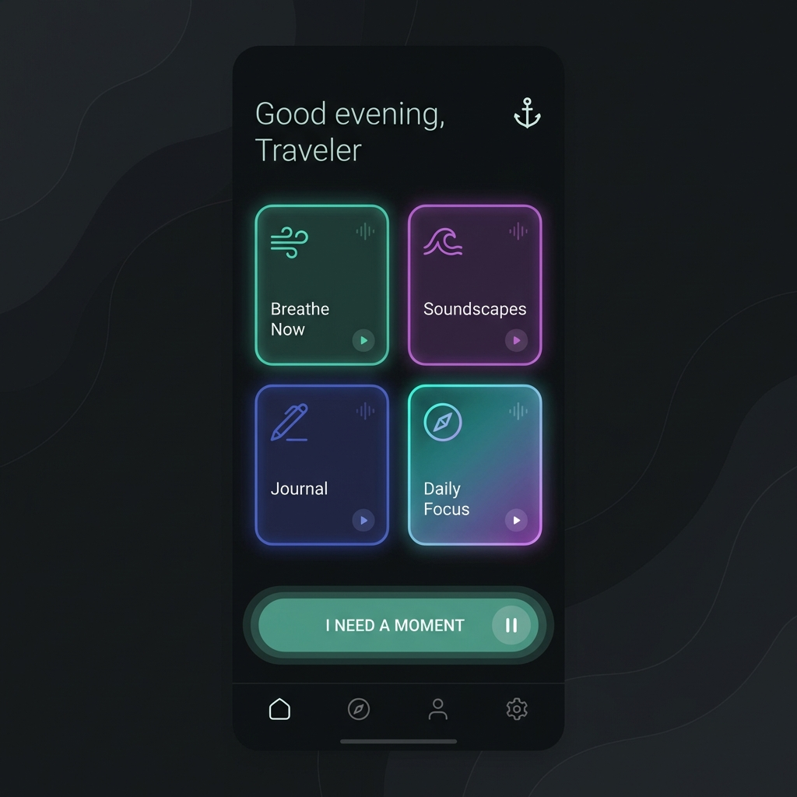

# Anchor ⚓️

**Anchor** is a "Zero Friction" anxiety relief and panic management application built with **React Native (Expo)**.

It provides immediate, haptic-driven tools to ground users during moments of high stress, alongside biological synchronization tools for deep rest.



## 🌟 Key Features

### 🚨 Zone 1: Panic Mode (Zero Friction)
Designed for immediate distress.
- **"I NEED A MOMENT"**: A single tap on the Dashboard launches an immediate intervention.
- **The Interrupter**: A sensory reset with black screen and heavy haptics.
- **Haptic Pacer**: Breathing exercise synchronized with device vibrations (mandatory 3 cycles).
- **Grounding**: Interactive "Bubble Popping" implementation of the 5-4-3-2-1 technique.
- **The Ice Dive**: Timer guide for Mammalian Dive Reflex (cold water shock) if anxiety persists.

### 🧘 Zone 2-4: Regulation & Rest
- **Focus Lab**: "Sorter Game" – A physics-based distraction task.
- **Sanctuary**: "Fractal Zoom" – Infinite zoom gesture for "Soft Fascination".
- **Decompression (Sonic Cocoon)**: Deep Indigo mixer for Brown Noise, Pink Noise, and Ambience. Includes an Interactive Body Scan ("The Melter").

### 🧠 Smart Check-ins
- **The Blob**: An organic, animated shape that reacts to your reported intensity.
- **Post-Session Check**: Smart routing logic – if you don't feel better, the app suggests deeper interventions like the Ice Dive.

## 🛠 Tech Stack

- **Framework**: [Expo](https://expo.dev/) (React Native) -> Managed Workflow.
- **Language**: TypeScript.
- **Animations**: 
  - `react-native-reanimated` (Shared Elements, Layout transitions).
  - `@shopify/react-native-skia` (High-performance 2D graphics for The Blob, Smoke, and Melter).
- **Gestures**: `react-native-gesture-handler`.
- **Haptics**: `expo-haptics` (Crucial for the tactile experience).
- **Audio**: `expo-av` (Background audio mixing for the Sonic Cocoon).
- **Navigation**: `expo-router` (File-based routing).

## 🚀 Getting Started

### Prerequisites
- Node.js (LTS recommended)
- iOS Simulator (Mac) or Android Emulator
- *Optional*: Physical Device with **Expo Go** app (Recommended for testing Haptics).

### Installation

1. **Clone the repository**
   ```bash
   git clone https://github.com/your-username/anchor.git
   cd anchor
   ```

2. **Install dependencies**
   ```bash
   npm install
   ```

3. **Start the development server**
   ```bash
   npx expo start
   ```

4. **Run on Device/Simulator**
   - Press `i` for iOS Simulator.
   - Press `a` for Android Emulator.
   - Scan the QR code with your phone's camera (iOS) or Expo Go app (Android).

## 📂 Project Structure

```
anchor/
├── app/                    # Expo Router pages
│   ├── index.tsx          # Splash Screen
│   ├── dashboard.tsx      # Main Dashboard
│   ├── check-in.tsx       # Triage Screen
│   └── zone/              # Activity Zones
│       ├── panic/         # Zone 1 (Interrupter, Pacer, Grounding, Ice Dive)
│       ├── focus/         # Zone 2 (Sorter Game)
│       ├── sanctuary/     # Zone 3 (Fractal Zoom)
│       └── decompression/ # Zone 4 (Mixer, Body Scan, Smoke)
├── components/            # Reusable UI components (TheBlob, Sliders)
├── constants/             # Theme Colors, Global Config
├── services/              # Supabase/Backend services
└── assets/                # Images, Fonts, Sounds
```

## ⚠️ Notes on Audio & Haptics
- **Audio**: The Sonic Cocoon uses remote URLs for sound assets. Ensure you have an internet connection for the first load.
- **Haptics**: Haptic feedback is best experienced on a physical device. Simulators offer limited or no haptic support.

## 🤝 Contributing
1. Fork the Project
2. Create your Feature Branch
3. Commit your Changes
4. Push to the Branch
5. Open a Pull Request

---
*Built with care for calm.*
